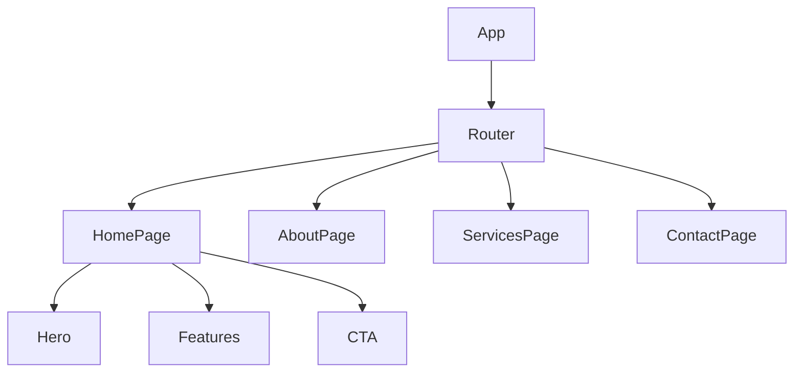
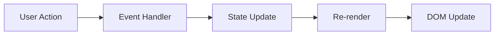
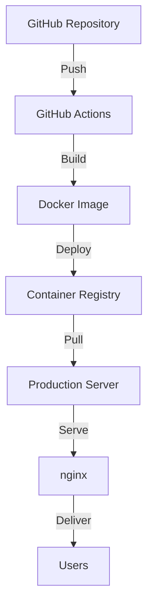
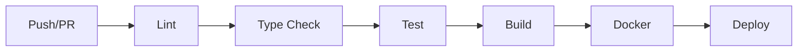

# Architecture Documentation

## Overview
[PLACEHOLDER: High-level description based on actual implementation]

This document describes the architectural decisions, component structure, and technical patterns used in the CBot Website project.

## Technology Decisions

### Frontend Framework: React 18+
**Reasoning**:
- Component-based architecture for reusability
- Strong TypeScript support
- Large ecosystem and community
- Excellent performance with hooks and concurrent features
- Virtual DOM for efficient updates

### Build Tool: Vite
**Reasoning**:
- Lightning-fast HMR (Hot Module Replacement)
- Native ES modules support
- Optimized production builds
- Better developer experience than webpack
- Built-in TypeScript support

### Styling: Tailwind CSS
**Reasoning**:
- Utility-first approach for rapid development
- Highly customizable design system
- Automatic CSS purging for small bundle size
- Consistent spacing and color scales
- Excellent IDE support

### Routing: React Router v6+
**Reasoning**:
- Standard for React navigation
- Code splitting and lazy loading support
- Type-safe with TypeScript
- Nested routes and layouts

## Component Architecture

[PLACEHOLDER: Will add actual component hierarchy after code review]



## Directory Structure

```
src/
├── components/       # Reusable UI components
│   ├── Button/
│   ├── Navigation/
│   └── Footer/
├── pages/           # Route-level page components
│   ├── Home/
│   ├── About/
│   └── Contact/
├── hooks/           # Custom React hooks
├── utils/           # Helper functions
├── assets/          # Static assets (images, fonts)
├── styles/          # Global CSS and Tailwind config
├── types/           # TypeScript type definitions
├── App.tsx          # Root component
└── main.tsx         # Application entry point
```

## State Management

[PLACEHOLDER: Document actual state management approach after implementation]

Strategy:
- React Context for global state (theme, auth, etc.)
- Local component state for UI-specific data
- Props for parent-child communication

## Data Flow



## Routing Strategy

### Route Structure
[PLACEHOLDER: Document actual routes after implementation]

```typescript
// Example route structure
const routes = [
  { path: '/', element: <HomePage /> },
  { path: '/about', element: <AboutPage /> },
  { path: '/services', element: <ServicesPage /> },
  { path: '/contact', element: <ContactPage /> },
  { path: '*', element: <NotFoundPage /> }
];
```

### Code Splitting
- Lazy loading for route components
- Reduces initial bundle size
- Faster time-to-interactive

```typescript
const AboutPage = lazy(() => import('./pages/About'));
```

## Performance Optimizations

### 1. Code Splitting
- Route-level splitting with React.lazy()
- Dynamic imports for heavy components

### 2. Image Optimization
- Lazy loading with `loading="lazy"`
- WebP format with fallbacks
- Responsive images with srcset

### 3. Component Optimization
- React.memo for pure components
- useMemo/useCallback for expensive computations
- Avoid unnecessary re-renders

### 4. Build Optimization
- Tailwind CSS purging
- Tree shaking
- Minification and compression
- Asset optimization

## Accessibility Strategy

### Standards Compliance
- WCAG 2.1 Level AA compliance
- Semantic HTML elements
- ARIA attributes where needed

### Implementation
- Keyboard navigation support
- Focus management
- Screen reader friendly
- Color contrast ratios (4.5:1 minimum)
- Skip links for main content

### Testing
- jest-axe for automated accessibility testing
- Manual keyboard navigation testing
- Screen reader testing (NVDA, JAWS, VoiceOver)

## Security Considerations

### Frontend Security
- No hardcoded secrets or API keys
- Input validation and sanitization
- XSS prevention (React's built-in protection)
- CSRF protection for forms
- Secure environment variable handling

### Content Security Policy
```nginx
add_header Content-Security-Policy "default-src 'self'; script-src 'self'; style-src 'self' 'unsafe-inline';";
```

## Deployment Architecture



### Container Strategy
- Multi-stage Docker build
- nginx for static file serving
- Non-root user for security
- Health checks for monitoring

## Testing Architecture

### Test Pyramid
```
        /\
       /  \
      / E2E \ (Future)
     /______\
    /        \
   /Integration\
  /____________\
 /              \
/   Unit Tests   \
/________________\
```

### Current Coverage
- Unit tests: Component behavior
- Integration tests: User flows
- Accessibility tests: WCAG compliance

### Tools
- Vitest: Test runner
- React Testing Library: Component testing
- jest-axe: Accessibility testing

## Build Pipeline

### Development
```bash
npm run dev
# Vite dev server with HMR
# http://localhost:5173
```

### Production Build
```bash
npm run build
# 1. TypeScript compilation
# 2. Vite bundling
# 3. Asset optimization
# 4. Output to dist/
```

### CI/CD Pipeline


## Future Enhancements

[PLACEHOLDER: To be added based on project evolution]

Potential additions:
- Progressive Web App (PWA) features
- Server-Side Rendering (SSR) with Vite SSR
- API integration layer
- Advanced state management (Redux, Zustand)
- End-to-end testing (Playwright, Cypress)

## Maintenance

### Dependency Updates
- Regular `npm audit` for security
- Monthly dependency updates
- Breaking change review before major updates

### Performance Monitoring
- Lighthouse CI in pipeline
- Core Web Vitals tracking
- Bundle size monitoring

---

**Last Updated**: [PLACEHOLDER: Date]
**Maintained By**: docs-writer
