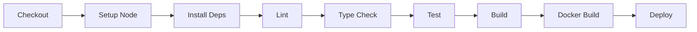

# Deployment Guide

## Table of Contents
1. [Local Development](#local-development)
2. [Production Build](#production-build)
3. [Docker Deployment](#docker-deployment)
4. [CI/CD Pipeline](#cicd-pipeline)
5. [Environment Variables](#environment-variables)
6. [Health Checks](#health-checks)
7. [Troubleshooting](#troubleshooting)

## Local Development

### Prerequisites
- Node.js 18+ and npm
- Git

### Setup
```bash
# Clone repository
git clone [REPO_URL]
cd cbot-website-project

# Install dependencies
npm install

# Start development server
npm run dev
```

### Access Application
- **URL**: http://localhost:5173
- **Hot Module Replacement**: Enabled automatically
- **Environment**: Development mode

### Development Commands
```bash
# Run tests
npm test

# Run tests with coverage
npm run test:coverage

# Lint code
npm run lint

# Type check
npm run type-check

# Preview production build locally
npm run build && npm run preview
```

## Production Build

### Build for Production
```bash
npm run build
```

### Build Output
- **Directory**: `dist/`
- **Contents**: Optimized static files
- **Size**: [PLACEHOLDER: Actual size after build]

### Build Process
1. TypeScript compilation
2. React component bundling
3. CSS purging and optimization
4. Asset minification
5. Source map generation

### Verify Build
```bash
# Preview production build
npm run preview

# Access at http://localhost:4173
```

## Docker Deployment

### Prerequisites
- Docker 20+
- docker-compose (optional)

### Build Docker Image
```bash
# Build image
docker build -t cbot-website:1.0.0 .

# Tag as latest
docker tag cbot-website:1.0.0 cbot-website:latest
```

### Docker Image Details
- **Base Image**: nginx:alpine
- **Multi-stage Build**: Yes
- **Final Size**: [PLACEHOLDER: Actual size]
- **User**: Non-root (nginx)
- **Port**: 80

### Run Container

#### Single Container
```bash
docker run -d \
  --name cbot-website \
  -p 80:80 \
  --restart unless-stopped \
  cbot-website:latest
```

#### Docker Compose
```bash
# Start services
docker-compose up -d

# View logs
docker-compose logs -f

# Stop services
docker-compose down
```

### Docker Health Check
```bash
# Check container health
docker inspect --format='{{.State.Health.Status}}' cbot-website

# Manual health check
curl http://localhost/
# Should return 200 OK
```

### Docker Commands Reference
```bash
# View running containers
docker ps

# View logs
docker logs cbot-website

# Stop container
docker stop cbot-website

# Remove container
docker rm cbot-website

# Remove image
docker rmi cbot-website:latest
```

## CI/CD Pipeline

### GitHub Actions Workflow

**Trigger Events**:
- Push to `main` branch
- Pull request to `main`

**Pipeline Steps**:


### Pipeline Details

#### 1. Lint and Type Check
```bash
npm run lint
npm run type-check
```
- **Failure**: Blocks merge
- **Duration**: ~30s

#### 2. Run Tests
```bash
npm run test:coverage
```
- **Requirements**:
  - All tests pass
  - Coverage ≥80%
- **Duration**: ~1-2min

#### 3. Security Scan
```bash
npm audit --audit-level=high
```
- **Blocks**: Critical/High vulnerabilities
- **Duration**: ~15s

#### 4. Build Application
```bash
npm run build
```
- **Output**: dist/ directory
- **Duration**: ~1min

#### 5. Docker Build
```bash
docker build -t cbot-website:${{ github.sha }} .
```
- **Tags**: commit SHA and latest
- **Duration**: ~2-3min

#### 6. Deploy (on main merge)
[PLACEHOLDER: Deployment target and process]

### Quality Gates
All must pass before merge to `main`:
- ✅ Lint passes
- ✅ Type check passes
- ✅ All tests pass
- ✅ Coverage ≥80%
- ✅ No Critical/High security issues
- ✅ Docker build successful
- ✅ Code review approved

## Environment Variables

### Development
Create `.env.local` (not committed):
```bash
# API endpoint (if needed)
VITE_API_URL=http://localhost:3000

# Analytics (optional)
VITE_GA_ID=
```

### Production
Set in deployment environment:
```bash
# Required
VITE_API_URL=https://api.example.com

# Optional
VITE_GA_ID=G-XXXXXXXXXX
```

### Environment File Structure
```
.env              # Default values (committed)
.env.local        # Local overrides (not committed)
.env.production   # Production defaults (committed)
```

### Access in Code
```typescript
// Vite automatically exposes VITE_ prefixed variables
const apiUrl = import.meta.env.VITE_API_URL;
```

## Health Checks

### HTTP Health Check
```bash
curl -f http://localhost/ || exit 1
```
- **Endpoint**: `/`
- **Expected**: 200 OK
- **Timeout**: 3s

### Docker Health Check
Defined in Dockerfile:
```dockerfile
HEALTHCHECK --interval=30s --timeout=3s --start-period=5s --retries=3 \
  CMD wget --no-verbose --tries=1 --spider http://localhost/ || exit 1
```

### Monitoring
- Check every 30 seconds
- 3-second timeout
- 3 retries before unhealthy
- 5-second startup grace period

## Troubleshooting

### Common Issues

#### Build Fails with TypeScript Errors
```bash
# Clean and rebuild
rm -rf dist node_modules
npm install
npm run build
```

#### Docker Container Won't Start
```bash
# Check logs
docker logs cbot-website

# Common causes:
# - Port 80 already in use
# - Build artifacts missing
# - nginx configuration error
```

#### Port 80 Already in Use
```bash
# Run on different port
docker run -d -p 8080:80 cbot-website

# Or find and stop conflicting process
lsof -i :80
```

#### Tests Failing in CI but Pass Locally
```bash
# Run tests in CI mode
CI=true npm test

# Common issues:
# - Timezone differences
# - Missing environment variables
# - File system case sensitivity
```

#### npm install Fails
```bash
# Clear npm cache
npm cache clean --force

# Remove lock file and retry
rm package-lock.json
npm install
```

#### High Memory Usage
```bash
# Limit Node memory
NODE_OPTIONS="--max-old-space-size=4096" npm run build
```

### Performance Issues

#### Slow Build Times
- Check bundle size: `npm run build -- --report`
- Review lazy loading implementation
- Verify Tailwind purging is enabled

#### Large Docker Image
```bash
# Check image size
docker images cbot-website

# Expected: <100MB for multi-stage build
# If larger, verify .dockerignore is working
```

### Getting Help
- Check [ARCHITECTURE.md](ARCHITECTURE.md) for technical details
- Review [GitHub Issues](https://github.com/[org]/[repo]/issues)
- Contact DevOps team: [PLACEHOLDER: Contact info]

## Rollback Procedure

### Docker Rollback
```bash
# Stop current version
docker stop cbot-website

# Start previous version
docker run -d --name cbot-website -p 80:80 cbot-website:previous-tag
```

### Git Rollback
```bash
# Revert to previous commit
git revert HEAD
git push origin main

# This triggers new CI/CD deployment
```

## Monitoring and Logs

### View Container Logs
```bash
# Real-time logs
docker logs -f cbot-website

# Last 100 lines
docker logs --tail 100 cbot-website
```

### nginx Access Logs
```bash
docker exec cbot-website cat /var/log/nginx/access.log
```

### nginx Error Logs
```bash
docker exec cbot-website cat /var/log/nginx/error.log
```

---

**Last Updated**: [PLACEHOLDER: Date]
**Maintained By**: docs-writer & devops-engineer
